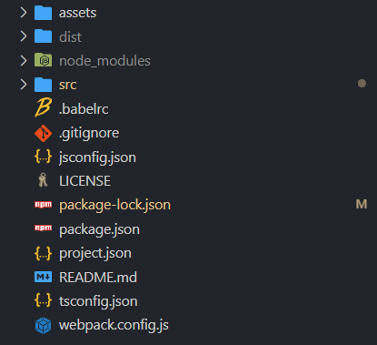

## 本章带你认识和使用基础模板

1. 首先用 vscode 打开一个目录，比如 D 盘

2. 打开 vscode 的终端（快捷键是`` ctrl + ` ``），执行 cli 命令创建一份空模板

```
# 创建一个auto-lesson1文件夹
auto-cli create auto-lesson1
```

直接回车选择`默认`模板，等待下载完毕。`ctrl + c`可以中止下载。

3. 使用 vscode 打开文件夹`auto-lesson1`，在终端执行`npm i`安装相关依赖。



项目结构说明

-   `assets`是静态资源文件夹，适合放图片、视频等资源。
-   `src`文件夹放程序源码，源码是完全没有任何依赖的。
-   `webpack.config.js`是配置文件，详见之前的[模板说明](/template)。
-   `project.json`是 auto 的项目配置文件。
-   `package.json`是 node 的配置文件。
-   `dist`是执行编译命令后自动生成的文件夹。

4. 依赖安装完毕后，在终端执行`npm start`即可编译`src`源码，并生成`dist`目录和文件。`src`是我们的源码，不会上传到手机端打包，手机端打包和运行的是`dist`文件夹内的文件。

5. 按 F1 打开 vscode 命令面板，连接设备并选择选择`运行项目(Run Project)`即可在运行项目。  
   （如果代码有错误是无法生成 `dist` 文件夹的）
